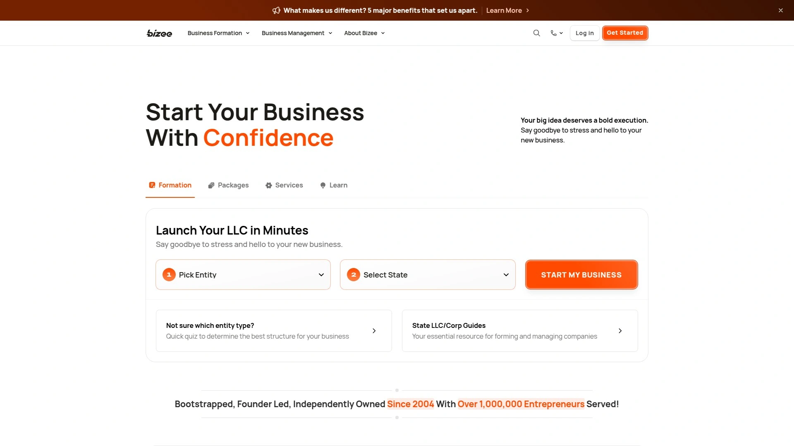

# Top 12 Virtual Mailbox Services Ranked in 2025 (Latest Compilation)

Running a business from your couch, traveling full-time, or just trying to keep your home address off the internet? A virtual mailbox gives you a real street address where your mail gets scanned and uploaded so you can handle it from anywhere. No more missed packages, no more asking neighbors to check your mailbox, and definitely no more using your living room as your official business address. These services range from basic mail scanning to full-on business presence solutions, with pricing that starts around ten bucks a month and scales based on what you actually need.

## **[Anytime Mailbox](https://anytimemailbox.com/)**

Your mail, managed from literally anywhere on earth.

Anytime Mailbox stands out with over 2,500 locations worldwide, which means you can pick an address in pretty much any major city or state you need. The platform handles everything from basic mail scanning to package forwarding, and some locations even offer check deposit services. Plans start at $9.99 per month with a 30-day money-back guarantee, so there's basically zero risk to trying it out.

The system sends instant notifications when new mail arrives, and you can request scans, forwarding, or secure shredding right from your phone. Everything runs through encrypted servers with 2048-bit SSL connections, and they never email images of your mail—it all stays in the secure web portal or mobile app. Whether you're a digital nomad, an LLC owner who needs privacy, or someone managing multiple businesses, the interface makes it simple to sort through mail without drowning in paper.

## **[iPostal1](https://ipostal1.com/)**

Digital mailbox network built on serious tech infrastructure.

Founded in 2015 by software engineer Jeff Milgram, iPostal1 operates over 4,000 mailbox locations globally. Their platform dates back to Milgram's original package-handling company, which translates to one of the smoothest online dashboards in the virtual mailbox space. The service caters heavily to RVers, expats, solo professionals, and small businesses who need a physical address that handles mail on their behalf.

You get a genuine street address where mail from USPS, FedEx, UPS, and DHL gets received and photographed. From there, you can view each piece through the app, request scans with real-time shipping prices for forwarding, or have items shredded. Unique features include unlimited cloud storage for digital copies and check deposit capabilities if you receive physical checks. Pricing starts at $9.99 monthly, making it competitive for individuals or solo entrepreneurs.

## **[PostScanMail](https://www.postscanmail.com/)**

Straightforward mail scanning with instant digital access.

PostScanMail focuses on getting your physical mail converted to digital format quickly and reliably. You sign up, select a virtual mailbox address from available locations, and all incoming mail gets scanned on the outside and uploaded to your online account for review. From there, you decide whether to open and scan the contents, forward packages worldwide, shred and recycle unwanted mail, or store items for future handling.

The service provides instant notifications and 24/7 online access through both web and mobile apps. Cloud storage integrations with Google Drive, Dropbox, Box, Evernote, and OneDrive keep your documents backed up and accessible anywhere. The starter plan runs $10 per month for travelers and students, while the standard plan at $20 monthly works well for startups or larger companies needing a commercial address.

## **[Traveling Mailbox](https://travelingmailbox.com/)**

Built specifically for people who never stay in one place.

Traveling Mailbox streamlines the entire virtual mailbox experience into four simple steps: sign up, fill out the USPS 1583 form, get it notarized and uploaded, then start managing your mail online. When mail arrives at the facility, it gets scanned and uploaded to your account where you can view and manage everything digitally. You can manually open and scan each piece or configure automatic scanning for all incoming mail.

The platform offers email notifications, unlimited cloud storage, and integration with popular cloud services so you always have backup copies of important documents. Users can organize scanned mail into custom folders—one for tax documents, another for deposited checks, another for insurance paperwork—making it easier to stay organized while moving around. The service works particularly well for RVers and frequent travelers who need reliable mail access without a fixed physical location.

## **[VirtualPostMail](https://www.virtualpostmail.com/)**

Owned-and-operated locations for maximum security and speed.

VirtualPostMail differentiates itself by offering only five primary hub addresses in California, Delaware, Florida, Texas, and Nevada—all directly owned and operated by the company rather than outsourced to third parties. This approach means greater security since only vetted employees handle your mail, better quality control without managing independent contractors, and faster processing since your mail is their priority. Mail scanning typically happens within one business day because everything is received and stored on-site.

Every virtual mailbox plan includes complimentary registered agent services in your chosen state, saving you $100 or more annually compared to competitors who charge extra. The service also offers remote check deposits processed and mailed out within one business day, which many competitors don't provide. Plans start at $20 monthly for the Basic plan, which includes free registered agent service, API access for automation, unlimited cloud storage, and up to 180 days of physical mail storage.

## **[US Global Mail](https://www.usglobalmail.com/)**

AI-powered mailbox that makes snail mail actually readable.

US Global Mail provides a permanent street address in your preferred US state for both personal and corporate requirements. The service is accessible to non-US citizens and residents, allowing anyone to obtain a US address and even establish a business in the United States regardless of citizenship status. Their AI-powered system digitizes physical mail and makes it readable, searchable, and summarized automatically.

California and Texas locations offer same-day to 24-hour turnaround for processing requests, which matters when you're waiting on time-sensitive documents. You can register for multiple addresses if needed, or use a business plan to incorporate multiple companies within a single virtual mailbox. The onboarding process requires two forms of identification and a notarized 1583 Form, and their customer support team assists with arranging the online notary appointment to get everything officially stamped and signed.

## **[Earth Class Mail](https://app.earthclassmail.com/)**

National network with automated check deposits and cloud integrations.

Earth Class Mail operates a network of over 40 virtual business addresses across the United States, giving businesses the prestigious address they want without the price tag of physical office space. The service receives mail at secure facilities, scans items and converts them to searchable PDFs, then securely delivers them to your account. Full-text search functionality lets you find any piece of mail no matter when you received it.

Mail forwarding works globally with push notifications when shipments are on the way, and secure shredding safely destroys documents while keeping digital copies if needed. The automated check deposit feature saves time by mailing checks directly to your bank instead of requiring manual scanning or bank visits. Cloud service integrations keep mail and data secure while allowing easy access from any device.

## **[Stable](https://www.usestable.com/)**

AI-powered platform built for businesses that hate mail admin.

Stable helps businesses remove friction from operations by providing a permanent street address that can be used with the IRS, vendors, state registrations, and anywhere else official documentation is needed. Mail received at your Stable address gets processed at their in-house facilities, immediately scanned, and uploaded to your platform where you can act on it from anywhere. The AI-powered automation system handles mail-driven workflows, enables team collaboration, and alerts you to time-sensitive and important actions.

The service allows businesses to go remote, expand, or relocate while keeping the same address, providing stability as your company changes. Premium addresses in top markets reduce overhead costs compared to physical office space, and electronic check deposits improve cashflow management. Plans start at $49 monthly for basic services, though registered agent service costs an additional $25 per month. Stable offers 30 days of free physical mail storage and unlimited cloud storage.

## **[Northwest Registered Agent](https://www.northwestregisteredagent.com/)**

Real street addresses with unique suite numbers for privacy.

Northwest Registered Agent's virtual office provides businesses with a unique physical street address—not a P.O. Box—that includes a personalized suite or unit number for added privacy. This address can be used for state filings, business licenses, bank accounts, business cards, and websites. The company employs over 900 people and maintains services for more than 3 million businesses nationwide.

Mail forwarding, scanning, and package handling are available for all major carriers including USPS, UPS, and FedEx. The virtual office service costs $29 monthly and includes same-day mail forwarding, a unique suite number, and a second US phone number with an area code in any state. Digital document delivery means important papers get scanned and sent digitally for quick viewing, and there are no long-term contracts required. The service works particularly well for home-based businesses wanting to keep their home address private and startups looking to keep costs low.

## **[Alliance Virtual Offices](https://www.alliancevirtualoffices.com/)**

Over 1,400 top-tier locations for building business credibility.

Alliance Virtual Offices operates more than 1,400 virtual office locations designed to elevate your business presence. Their virtual mailing address services give businesses a professional address in high-profile locations without the overhead costs of traditional office space. Services include mail forwarding options (weekly, monthly, store-and-collect, or ad-hoc), dedicated telephone services with trained receptionists, and access to global business lounges.

Receptionists handle incoming calls professionally, taking messages, forwarding calls, or providing basic business information to maintain a consistent impression even if you operate remotely. The flexibility and affordability compared to traditional office spaces make it suitable for mobile and remote workforces, eliminating expenses associated with leasing and maintaining physical offices. Virtual office plans cater to businesses wanting to establish presence in specific cities—for example, their San Diego locations put you in the same area as industry leaders like Qualcomm and General Atomics.

## **[PhysicalAddress.com](https://physicaladdress.com/)**

In-house processing with no outsourcing at budget-friendly rates.

PhysicalAddress.com provides virtual mailbox services starting at just $7.98 per month, making it one of the most affordable options available. All operations are handled in-house without outsourcing, and mail processing uses high-quality scans that arrive quickly enough for practical use like mobile check deposits. The service has been operating for years with generally positive client reviews, though like any mail service, processing times can occasionally be affected by USPS delays.

You get to view postal mail online with a real street address and private suite number for both business and personal use. The interface is intuitive and easy to use with reasonable package prices. Mail forwarding pricing tends to be cheaper than competitors, and the quality of scans is high enough to print documents or use banking apps for check deposits. The service works well for expats, digital nomads, and businesses needing a simple, cost-effective virtual address solution.

## **[Bizee](https://bizee.com/)**

Virtual address built into business formation services.

Bizee (formerly Incfile) has served over 1 million customers for more than 20 years, providing virtual address services alongside business formation and management tools. Their virtual address service costs $29 per month and gives you a stable street address in a major US city that makes your business look more professional and established. All paper mail received at the virtual address gets scanned and uploaded to a secure, private portal where you can read and review mail instantly.

The service only accepts letters and large envelopes—no packages—which is important to know upfront. Any bank checks, credit cards, or debit cards received get mail forwarded via USPS to your contact address on file. The address can be used for Articles of Incorporation, business cards, websites, and even to obtain your Employer Identification Number (EIN) since it's an actual street location rather than a P.O. Box. No long-term commitment is required and you can cancel anytime.

---

## How do I choose the right virtual mailbox location?

Pick a state that makes sense for your business registration and tax purposes first. If you're a digital nomad and location doesn't matter much, go for facilities in California or Texas since they tend to offer faster processing times—usually same-day to 24-hour turnaround. Consider whether you need the address for LLC registration, banking, or just mail management, since some states have more favorable business laws than others.

## Can I use a virtual mailbox address to register my LLC?

Yes, virtual mailboxes provide real street addresses that work for LLC registration, EIN applications, and business bank accounts. Just make sure the service isn't using a P.O. Box, since those can cause issues with certain government filings and financial institutions. Most reputable services provide actual commercial addresses with unique suite numbers specifically for this purpose.

## What's the difference between cheap and expensive virtual mailbox plans?

The basic difference comes down to processing speed, number of mail scans included, physical storage duration, and extra features like registered agent service or check deposits. Budget services starting around $8-$10 monthly work fine for simple mail scanning, while premium plans at $30-$50 monthly include faster processing, more team member access, API integrations for automation, and complimentary services that would otherwise cost extra. If you're just receiving occasional personal mail, go cheap; if you're running an actual business with time-sensitive documents, the extra features usually pay for themselves.

---

## Wrapping This Up

Managing mail remotely doesn't have to be complicated or expensive anymore. Whether you need a quick address for your startup, a permanent business presence across multiple states, or just a way to avoid giving out your home address, there's a service on this list that handles it. [Anytime Mailbox](https://anytimemailbox.com/) takes the top spot because of its massive 2,500+ location network and straightforward pricing—perfect if you need flexibility in where your address is located and want reliable mail scanning without the headache.
